 
 
# 数字图像处理课程作业实验六

**张程博昊**

**自动化64**

**2160504106**

**2019年3月31日**

## 摘要
此次实验主要对图像添加了不同参数的高斯噪声、椒盐噪声，并使用一些种类的滤波器对其进行复原处理，通过结果分析了各种滤波器的优缺点。除此之外，还设计了模糊滤波器，将其matlab自带函数进行比较，并用维纳滤波器和最小二乘法对图像进行了复原，分析了其优缺点及适用范围。通过这次实验，对图像的噪声和复原有了更深入的了解。

## 实验内容

### 1.在测试图像上产生高斯噪声lena图-需能指定均值和方差；并用多种滤波器恢复图像，分析各自优缺点；

(1)在MATLAB中借用imnoise（）函数，得出以下结果：

均值0.1，方差0.01

均值0.1，方差0.1

均值0.05，方差0.01

（2）不同滤波器恢复结果：

三阶算术均值滤波器的恢复结果：

五阶算术均值滤波器的恢复结果：

三阶中值滤波器的恢复结果：

五阶算术均值滤波器的恢复结果：

谐波均值滤波器的恢复结果：

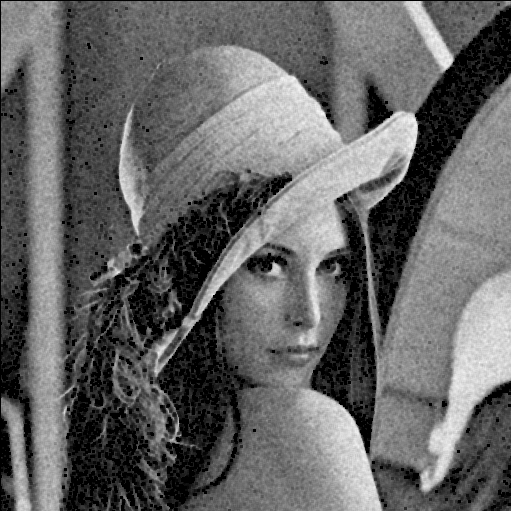

**优缺点：**

对lena.bmp分别用三阶算术均值滤波器、五阶算术均值滤波器、三阶中值滤波器、五阶中值滤波器、谐波滤波器进行处理。通过对结果的分析，得到以下结论：

1.对此图像，算术均值滤波器与中值滤波器结果较为相似，效果都较好，而对这两种滤波器，五阶平滑效果更为明显，图像相对模糊，但对高斯噪声处理更为有效。

2.对于谐波均值滤波器，结果和上两者三阶较为相似，对噪声的过滤较为有效。

### 2.在测试图像lena图加入椒盐噪声（椒和盐噪声密度均是0.1）；用学过的滤波器恢复图像；在使用反谐波分析Q大于0和小于0的作用；

（1）利用imnoise函数，可得到以下椒盐噪声处理结果：
 

（2）不同滤波器恢复结果：

三阶算术均值滤波器的恢复结果：

五阶算术均值滤波器的恢复结果：

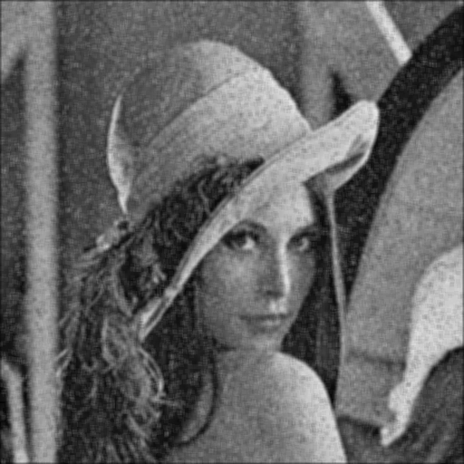

三阶中值滤波器的恢复结果：

五阶中值滤波器的恢复结果：

谐波均值滤波器的恢复结果：

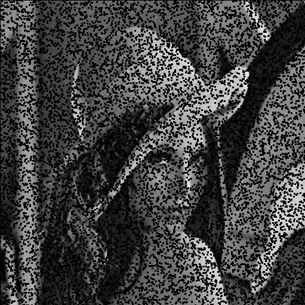

（3）使用逆谐波滤波器处理

逆谐波均值滤波器的恢复结果：

Q = -1

Q = 0

Q = 0.1

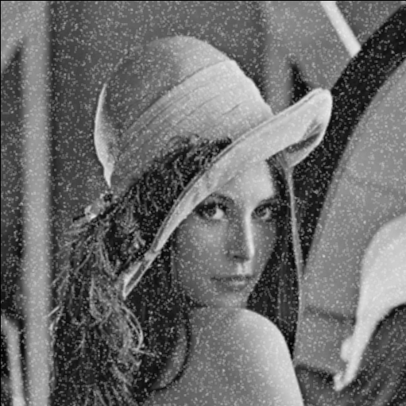

Q = 0.3

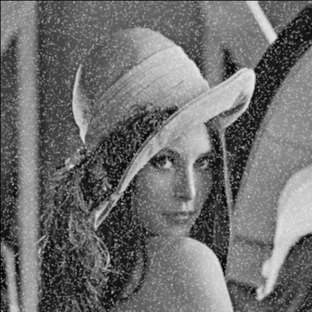

Q = 0.5

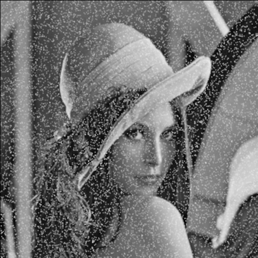

Q = 1

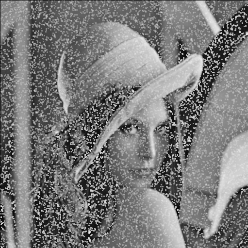

**结果分析：**

（1）在对椒盐噪声的处理中，算术均值滤波器效果很差，中值滤波器的效果较好。

（2）对于谐波均值滤波器，只能处理盐噪声，对椒噪声无法处理。

（3）对于逆谐波均值滤波器，当Q=-1，效果与谐波均值滤波器一致；对于
 

### 3.推导维纳滤波器并实现下边要求；

(a) 实现模糊滤波器如方程Eq. (5.6-11).

(b) 模糊lena图像：45度方向，T=1；

(c) 再模糊的lena图像中增加高斯噪声，均值= 0 ，方差=10 pixels 以产生模糊图像；

(d)分别利用方程 Eq. (5.8-6)和(5.9-4)，恢复图像；并分析算法的优缺点.

(b)

自己编的模糊函数如下：

不补零：

补零：

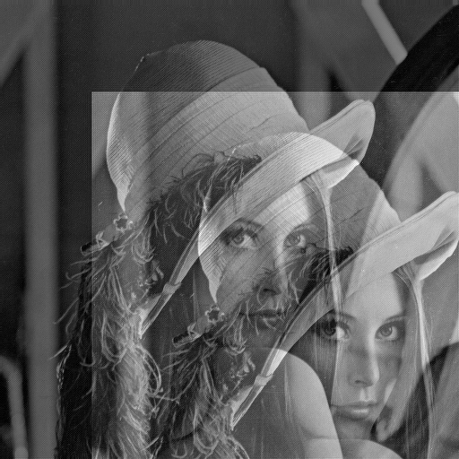

自带函数:

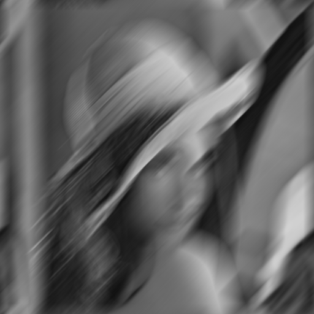

(c)

自己模糊：

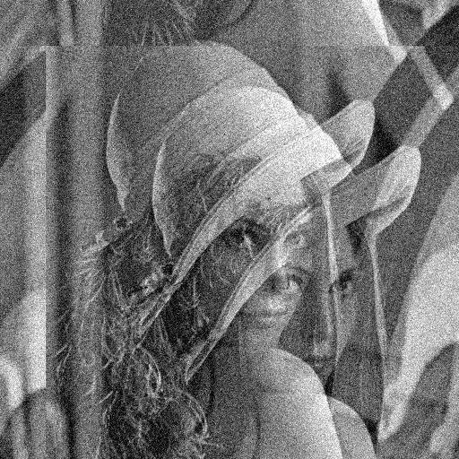

matlab：

(d)

维纳恢复：

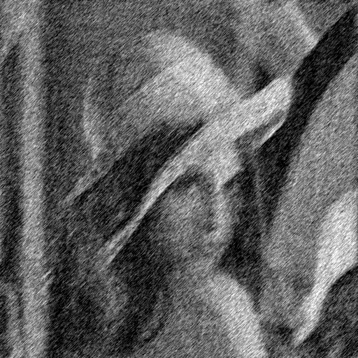

 维纳滤波建立在最小均方差上，可以如下表示：
 
 
 
 这里的E是期望，将此式展开，可重新表示为下式：
 
 
 
 将此式二次方展开，得到下边的式子：
 
 
 
 当我们假设噪声与信号独立无关，得到：
 
 
 
 在此，我们可定义功率谱：
 
 

 将其带入并对G（f）求导，令方程得零

 
 
 由此，推得维纳滤波方程；
 
 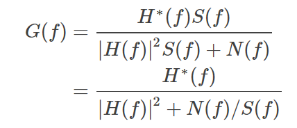

 
**结果分析：**
根据以上图片，可以得出以下结论：

USM处理：得到了边缘较清晰的图像，但边缘线较粗。

laplace：边缘线较细，效果较差，对噪声抑制效果较差。

## 附录

代码见文件

## 参考文献

[1] 冈萨雷斯, 数字图像处理（第三版）, 电子工业出版社
[2] Hairong Qi lecture Notes on the Gaussian Distribution

