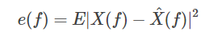
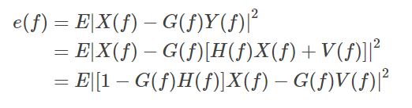
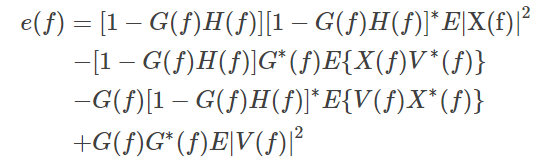
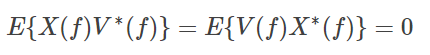
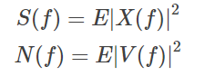
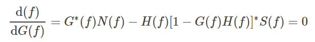

 
 
# 数字图像处理课程作业实验六

**张程博昊**

**自动化64**

**2160504106**

**2019年3月31日**

## 摘要
此次实验主要设计应用了频域的各种高通、低通滤波器，对不同图像分别进行了平滑、边缘增强处理。并对不同的滤波器进行比较，分析了其优缺点及适用范围。通过这次实验，对频域滤波有了更深入的了解。

## 实验内容

### 1.在测试图像上产生高斯噪声lena图-需能指定均值和方差；并用多种滤波器恢复图像，分析各自优缺点；
在MATLAB中借用fft2(),fftshift（）等函数，编写出两种低通滤波器，得出结果如下：

高斯低通滤波器：

巴特沃斯低通滤波器：

**优缺点：**

对test1、test2两张图片分别用高斯低通滤波器、巴特沃斯低通滤波器进行处理，并分别使用不同的的半径，在此使用25、50、75三种不同的半径。通过对结果的分析，得到以下结论：

1.对于同种滤波器，在半径较小时，图片较为模糊，当半径增大时，图片逐渐清晰。并且随着半径的增大，功率谱比逐渐增大，即包含更多的低频分量。

2.对于不同种滤波器，可以看出两者效果基本一致，均有平滑作用，但视觉看来巴特沃斯低通滤波器平滑作用更为明显，图片也更为模糊。

### 2.在测试图像lena图加入椒盐噪声（椒和盐噪声密度均是0.1）；用学过的滤波器恢复图像；在使用反谐波分析Q大于0和小于0的作用；

在MATLAB中借用fft2(),fftshift（）等函数，编写出两种低通滤波器，得出结果如下：
 
高斯高通滤波器：

巴特沃斯高通滤波器：

**优缺点：**
对test3、test4两张图片分别用高斯高通滤波器、巴特沃斯高通滤波器进行处理，并分别使用不同的的半径，在此使用25、50、75三种不同的半径。通过对结果的分析，得到以下结论：

1.对于同种滤波器，在半径较小时，边缘较为清晰，当半径增大时，图片逐渐模糊。并且随着半径的增大，功率谱比逐渐减小，即包含更少的高频分量。

2.对于不同种滤波器，可以看出两者效果基本一致，均有突出边缘的作用，可以看出巴特沃斯滤波器太过灵敏，对一些非边缘处理错误。而高斯滤波器处理较好，但边缘没有巴特沃斯高通滤波器清晰
 

### 3.推导维纳滤波器并实现下边要求；

(a) 实现模糊滤波器如方程Eq. (5.6-11).

(b) 模糊lena图像：45度方向，T=1；

(c) 再模糊的lena图像中增加高斯噪声，均值= 0 ，方差=10 pixels 以产生模糊图像；

(d)分别利用方程 Eq. (5.8-6)和(5.9-4)，恢复图像；并分析算法的优缺点.

通过对算法的原理的学习，用MATLAB编写了USM、Laplace滤波器，结果如下:

laplace高通滤波器：
 
 
 

USM高通滤波器：
 
  
 
 
 
**结果分析：**
根据以上图片，可以得出以下结论：

USM处理：得到了边缘较清晰的图像，但边缘线较粗。

laplace：边缘线较细，效果较差，对噪声抑制效果较差。

## 附录

代码见文件

## 参考文献

[1] 冈萨雷斯, 数字图像处理（第三版）, 电子工业出版社
[2] Hairong Qi lecture Notes on the Gaussian Distribution

 
 
 
 
 
 
 
 
 
 
 
 

 
